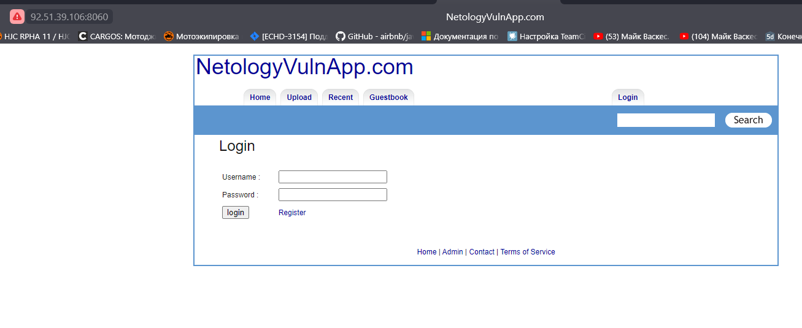

## Краткие выводы

По итогам тестирования были обнаружены следующие проблемы:  

| № | Критичность | Название | Приложение |
|---|-------------|----------|------------|
| 1 | <font color="red">**Высокая**</font> | **Уязвимости Denial of Service, Command Injection ([A05:2021-Security Misconfiguration](https://owasp.org/Top10/A05_2021-Security_Misconfiguration/), [A03:2021-Injection](https://owasp.org/Top10/A03_2021-Injection/))** | Оба приложения |
| 2 | <font color="red">**Высокая**</font> | **Уязвимость [Path Traversal](https://owasp.org/www-community/attacks/Path_Traversal) ([A01:2021-Broken Access Control](https://owasp.org/Top10/A01_2021-Broken_Access_Control/))** | Оба приложения |
| 3 | <font color="red">**Высокая**</font> | **Уязвимость [Unrestricted File Upload](https://owasp.org/www-community/vulnerabilities/Unrestricted_File_Upload). ([A03:2021-Injection](https://owasp.org/Top10/A03_2021-Injection/))** | Оба приложения |
| 4 | <font color="red">**Высокая**</font> | **Уязвимость [SQL Injection](https://owasp.org/www-community/attacks/SQL_Injection) ([A03:2021-Injection](https://owasp.org/Top10/A03_2021-Injection/))** | Оба приложения |
| 5 | <font color="red">**Высокая**</font> | **Слабый пароль администратора ([A07:2021-Identification and Authentication Failures](https://owasp.org/Top10/A07_2021-Identification_and_Authentication_Failures/))** | NetologyVulnApp |
| 6 | <font color="orange">**Средняя**</font> | **Использование чужой сессии. ([A07:2021-Identification and Authentication Failures](https://owasp.org/Top10/A07_2021-Identification_and_Authentication_Failures/))** | NetologyVulnApp |
| 7 | <font color="orange">**Средняя**</font> | **Уязвимость к XSS атакам ([A03:2021-Injection](https://owasp.org/Top10/A03_2021-Injection/), [Stored XSS](https://owasp.org/www-community/attacks/xss/#stored-xss-attacks))** | Оба приложения |
| 8 | <font color="orange">**Средняя**</font> | **Уязвимость к BruteForce атакам. ([A07:2021-Identification and Authentication Failures](https://owasp.org/Top10/A07_2021-Identification_and_Authentication_Failures/))** | Оба приложения |
| 9 | <font color="orange">**Средняя**</font> | **Отсутствие защиты от атак типа Сlickjacking, XSRF. ([A01:2021-Broken Access Control](https://owasp.org/Top10/A01_2021-Broken_Access_Control/))** | Оба приложения |

На тестируемом сервисе `NetologyVulnApp` есть функционал добавления в корзину картинок и покупки. Средством монетизации сайта вероятно является именно посредничество при покупке и продаже, соответственно простой сайта на неопределенное время, использование чужой сессии для покупок, кража базы данных и добавление товара в чужую корзину является серьезным риском потери прибыли и репутации.  
На другом тестируемом сервисе `Beemer` есть функционал проверки доступности сервера по IP и я так понимаю блог про автомобили. Тут средством монетизации веротно будет реклама.  
В любом случае, помимо издержек от остановки сайта, компания может стать жертвой шпионажа или майнеров криптовалюты, которые будут использовать мощности сервера.  

В первую очередь рекомендованы к устранению уязвимости с `Высокой` уровнем критичности.  
Для устранения уязвимостей и профилактики появления новых уязвимостей рекомендуется:
- Оценить уровень компании по OWASP SAMM
- Проверить процессы разработки ПО по `ГОСТ Р ИСО/МЭК 12207-2010`
- Внедрить практики безопасной разработки ПО, такие как статический анализ кода, динамический анализ кода, анализ зависимостей ПО. За основу можно взять `ГОСТ Р 56939-2016 Защита информации. Разработка безопасного программного обеспечения. Общие требования.`  
- Внедрить систему менеджемта ИБ (`ГОСТ Р ИСО/МЭК 27001-2021`)

## Этап 1. OSINT

Для сбора информации о адресе использованы следующие сервисы:  
- [shodan.io](https://www.shodan.io)
- [censys.io](https://search.censys.io)

Скриншот результатов:  
  

В результате была обнаружена следующая информация: 
- Местонахождение сервера (Russia, Saint Petersburg)
- Версия ОС (Ubuntu Linux 20.04)
- Открытые порты с установленным ПО
    - 22/SSH (OpenBSD OpenSSH 8.2)
    - 7799/HTTP (веб-сайт Beemer, веб-сервер TornadoWeb Tornado 5.1.1)
    - 8060/HTTP (веб-сайт NetologyVulnApp.com, веб-сервер Apache HTTPD 2.4.7, язык PHP 5.5.9 )

<details>
<summary>Скриншоты обнаруженных сайтов</summary>




</details>

## Этап 2. Scanning

Для сканирования хоста использовались инструменты:
 - NMap
 - Nikto
 - DirSearch

В ходе тестирования было обнаружено, что на хосте установлена система предотвращения вторжений (FortiGuard).
Для попытки обхода данной системы снижена скорость работы сканера nmap (с помощью параметра T0) и установлен таймаут между тестами в сканере nikto (-Pause 0.4 -timeout 3) 
Nmap запущен в режиме обнаружения сервисов с использованием плагина `vulners`

<details>
<summary>Результаты сканирования Nmap</summary>

```sh
$ nmap -sV -T4 --script vulners 92.51.39.106
Starting Nmap 7.93 ( https://nmap.org ) at 2023-09-28 16:41 +03
Nmap scan report for 1427771-cg36175.tw1.ru (92.51.39.106)
Host is up (0.011s latency).
Not shown: 990 closed tcp ports (conn-refused)
PORT     STATE SERVICE    VERSION
21/tcp   open  tcpwrapped
22/tcp   open  ssh        OpenSSH 8.2p1 Ubuntu 4ubuntu0.2 (Ubuntu Linux; protocol 2.0)
| vulners:
|   cpe:/a:openbsd:openssh:8.2p1:
|       CVE-2020-15778  6.8     https://vulners.com/cve/CVE-2020-15778
|       C94132FD-1FA5-5342-B6EE-0DAF45EEFFE3    6.8     https://vulners.com/githubexploit/C94132FD-1FA5-5342-B6EE-0DAF45EEFFE3  *EXPLOIT*
|       10213DBE-F683-58BB-B6D3-353173626207    6.8     https://vulners.com/githubexploit/10213DBE-F683-58BB-B6D3-353173626207  *EXPLOIT*
|       PRION:CVE-2020-12062    5.0     https://vulners.com/prion/PRION:CVE-2020-12062
|       CVE-2020-12062  5.0     https://vulners.com/cve/CVE-2020-12062
|       PRION:CVE-2021-28041    4.6     https://vulners.com/prion/PRION:CVE-2021-28041
|       CVE-2021-28041  4.6     https://vulners.com/cve/CVE-2021-28041
|       PRION:CVE-2021-41617    4.4     https://vulners.com/prion/PRION:CVE-2021-41617
|       CVE-2021-41617  4.4     https://vulners.com/cve/CVE-2021-41617
|       CVE-2020-14145  4.3     https://vulners.com/cve/CVE-2020-14145
|       CVE-2016-20012  4.3     https://vulners.com/cve/CVE-2016-20012
|       PRION:CVE-2021-36368    2.6     https://vulners.com/prion/PRION:CVE-2021-36368
|_      CVE-2021-36368  2.6     https://vulners.com/cve/CVE-2021-36368
25/tcp   open  tcpwrapped
80/tcp   open  tcpwrapped
110/tcp  open  tcpwrapped
143/tcp  open  tcpwrapped
2000/tcp open  tcpwrapped
5060/tcp open  tcpwrapped
7799/tcp open  http    Tornado httpd 5.1.1
|_http-server-header: TornadoServer/5.1.1
| vulners:
|   cpe:/a:tornadoweb:tornado:5.1.1:
|       OSV:PYSEC-2023-75       5.8     https://vulners.com/osv/OSV:PYSEC-2023-75
|       OSV:GHSA-HJ3F-6GCP-JG8J 5.8     https://vulners.com/osv/OSV:GHSA-HJ3F-6GCP-JG8J
|_      OSV:GHSA-QPPV-J76H-2RPX 0.0     https://vulners.com/osv/OSV:GHSA-QPPV-J76H-2RPX
8008/tcp open  http
| fingerprint-strings:
|   FourOhFourRequest:
|     HTTP/1.1 302 Found
|     Location: https://:8010/nice%20ports%2C/Tri%6Eity.txt%2ebak
|     Connection: close
|     X-Frame-Options: SAMEORIGIN
|     X-XSS-Protection: 1; mode=block
|     X-Content-Type-Options: nosniff
|     Content-Security-Policy: frame-ancestors 'self'
|   GenericLines, HTTPOptions, RTSPRequest, SIPOptions:
|     HTTP/1.1 302 Found
|     Location: https://:8010
|     Connection: close
|     X-Frame-Options: SAMEORIGIN
|     X-XSS-Protection: 1; mode=block
|     X-Content-Type-Options: nosniff
|     Content-Security-Policy: frame-ancestors 'self'
|   GetRequest:
|     HTTP/1.1 302 Found
|     Location: https://:8010/
|     Connection: close
|     X-Frame-Options: SAMEORIGIN
|     X-XSS-Protection: 1; mode=block
|     X-Content-Type-Options: nosniff
|_    Content-Security-Policy: frame-ancestors 'self'
8010/tcp open  ssl/xmpp?
| fingerprint-strings:
|   GenericLines, GetRequest:
|     HTTP/1.1 200 OK
|     Content-Length: 4492
|     Connection: close
|     Cache-Control: no-cache
|     Content-Type: text/html; charset=utf-8
|     X-Frame-Options: SAMEORIGIN
|     X-XSS-Protection: 1; mode=block
|     X-Content-Type-Options: nosniff
|     Content-Security-Policy: frame-ancestors 'self'
|     <!DOCTYPE html>
|     <html lang="en">
|     <head>
|     <meta charset="UTF-8">
|     <meta http-equiv="X-UA-Compatible" content="IE=8; IE=EDGE">
|     <meta name="viewport" content="width=device-width, initial-scale=1">
|     <style type="text/css">
|     body {
|     height: 100%;
|     font-family: Helvetica, Arial, sans-serif;
|     color: #6a6a6a;
|     margin: 0;
|     display: flex;
|     align-items: center;
|     justify-content: center;
|_    input[type=date], input[type=email], input[type=number], input[type=password]
2 services unrecognized despite returning data. 
Service Info: OS: Linux; CPE: cpe:/o:linux:linux_kernel
8060/tcp open  http    Apache httpd 2.4.7 ((Ubuntu))
|_http-server-header: Apache/2.4.7 (Ubuntu)
| vulners:
|   cpe:/a:apache:http_server:2.4.7:
|       PACKETSTORM:171631      7.5     https://vulners.com/packetstorm/PACKETSTORM:171631      *EXPLOIT*
|       EDB-ID:51193    7.5     https://vulners.com/exploitdb/EDB-ID:51193      *EXPLOIT*
|       CVE-2023-25690  7.5     https://vulners.com/cve/CVE-2023-25690
|       CVE-2022-31813  7.5     https://vulners.com/cve/CVE-2022-31813
|       CVE-2022-23943  7.5     https://vulners.com/cve/CVE-2022-23943
|       CVE-2021-44790  7.5     https://vulners.com/cve/CVE-2021-44790
|       CVE-2021-39275  7.5     https://vulners.com/cve/CVE-2021-39275
|       CVE-2021-26691  7.5     https://vulners.com/cve/CVE-2021-26691
|       CVE-2017-7679   7.5     https://vulners.com/cve/CVE-2017-7679
|       CVE-2017-3167   7.5     https://vulners.com/cve/CVE-2017-3167
|       CNVD-2022-73123 7.5     https://vulners.com/cnvd/CNVD-2022-73123
|       CNVD-2022-03225 7.5     https://vulners.com/cnvd/CNVD-2022-03225
|       CNVD-2021-102386        7.5     https://vulners.com/cnvd/CNVD-2021-102386
|       5C1BB960-90C1-5EBF-9BEF-F58BFFDFEED9    7.5     https://vulners.com/githubexploit/5C1BB960-90C1-5EBF-9BEF-F58BFFDFEED9  *EXPLOIT*
|       1337DAY-ID-38427        7.5     https://vulners.com/zdt/1337DAY-ID-38427        *EXPLOIT*
|       PACKETSTORM:127546      6.8     https://vulners.com/packetstorm/PACKETSTORM:127546      *EXPLOIT*
|       FDF3DFA1-ED74-5EE2-BF5C-BA752CA34AE8    6.8     https://vulners.com/githubexploit/FDF3DFA1-ED74-5EE2-BF5C-BA752CA34AE8  *EXPLOIT*
|       CVE-2021-40438  6.8     https://vulners.com/cve/CVE-2021-40438
|       CVE-2020-35452  6.8     https://vulners.com/cve/CVE-2020-35452
|       CVE-2018-1312   6.8     https://vulners.com/cve/CVE-2018-1312
|       CVE-2017-15715  6.8     https://vulners.com/cve/CVE-2017-15715
|       CVE-2016-5387   6.8     https://vulners.com/cve/CVE-2016-5387
|       CVE-2014-0226   6.8     https://vulners.com/cve/CVE-2014-0226
|       CNVD-2022-03224 6.8     https://vulners.com/cnvd/CNVD-2022-03224
|       8AFB43C5-ABD4-52AD-BB19-24D7884FF2A2    6.8     https://vulners.com/githubexploit/8AFB43C5-ABD4-52AD-BB19-24D7884FF2A2  *EXPLOIT*
|       4810E2D9-AC5F-5B08-BFB3-DDAFA2F63332    6.8     https://vulners.com/githubexploit/4810E2D9-AC5F-5B08-BFB3-DDAFA2F63332  *EXPLOIT*
|       4373C92A-2755-5538-9C91-0469C995AA9B    6.8     https://vulners.com/githubexploit/4373C92A-2755-5538-9C91-0469C995AA9B  *EXPLOIT*
|       1337DAY-ID-22451        6.8     https://vulners.com/zdt/1337DAY-ID-22451        *EXPLOIT*
|       0095E929-7573-5E4A-A7FA-F6598A35E8DE    6.8     https://vulners.com/githubexploit/0095E929-7573-5E4A-A7FA-F6598A35E8DE  *EXPLOIT*
|       CVE-2022-28615  6.4     https://vulners.com/cve/CVE-2022-28615
|       CVE-2021-44224  6.4     https://vulners.com/cve/CVE-2021-44224
|       CVE-2017-9788   6.4     https://vulners.com/cve/CVE-2017-9788
|       CVE-2019-0217   6.0     https://vulners.com/cve/CVE-2019-0217
|       CVE-2022-22721  5.8     https://vulners.com/cve/CVE-2022-22721
|       CVE-2020-1927   5.8     https://vulners.com/cve/CVE-2020-1927
|       CVE-2019-10098  5.8     https://vulners.com/cve/CVE-2019-10098
|       1337DAY-ID-33577        5.8     https://vulners.com/zdt/1337DAY-ID-33577        *EXPLOIT*
|       CVE-2022-36760  5.1     https://vulners.com/cve/CVE-2022-36760
|       SSV:96537       5.0     https://vulners.com/seebug/SSV:96537    *EXPLOIT*
|       SSV:62058       5.0     https://vulners.com/seebug/SSV:62058    *EXPLOIT*
|       SSV:61874       5.0     https://vulners.com/seebug/SSV:61874    *EXPLOIT*
|       EXPLOITPACK:DAED9B9E8D259B28BF72FC7FDC4755A7    5.0     https://vulners.com/exploitpack/EXPLOITPACK:DAED9B9E8D259B28BF72FC7FDC4755A7    *EXPLOIT*
|       EXPLOITPACK:C8C256BE0BFF5FE1C0405CB0AA9C075D    5.0     https://vulners.com/exploitpack/EXPLOITPACK:C8C256BE0BFF5FE1C0405CB0AA9C075D    *EXPLOIT*
|       EDB-ID:42745    5.0     https://vulners.com/exploitdb/EDB-ID:42745      *EXPLOIT*
|       EDB-ID:40961    5.0     https://vulners.com/exploitdb/EDB-ID:40961      *EXPLOIT*
|       CVE-2022-37436  5.0     https://vulners.com/cve/CVE-2022-37436
|       CVE-2022-30556  5.0     https://vulners.com/cve/CVE-2022-30556
|       CVE-2022-29404  5.0     https://vulners.com/cve/CVE-2022-29404
|       CVE-2022-28614  5.0     https://vulners.com/cve/CVE-2022-28614
|       CVE-2022-26377  5.0     https://vulners.com/cve/CVE-2022-26377
|       CVE-2021-34798  5.0     https://vulners.com/cve/CVE-2021-34798
|       CVE-2021-26690  5.0     https://vulners.com/cve/CVE-2021-26690
|       CVE-2020-1934   5.0     https://vulners.com/cve/CVE-2020-1934
|       CVE-2019-17567  5.0     https://vulners.com/cve/CVE-2019-17567
|       CVE-2019-0220   5.0     https://vulners.com/cve/CVE-2019-0220
|       CVE-2018-17199  5.0     https://vulners.com/cve/CVE-2018-17199
|       CVE-2018-1303   5.0     https://vulners.com/cve/CVE-2018-1303
|       CVE-2017-9798   5.0     https://vulners.com/cve/CVE-2017-9798
|       CVE-2017-15710  5.0     https://vulners.com/cve/CVE-2017-15710
|       CVE-2016-8743   5.0     https://vulners.com/cve/CVE-2016-8743
|       CVE-2016-2161   5.0     https://vulners.com/cve/CVE-2016-2161
|       CVE-2016-0736   5.0     https://vulners.com/cve/CVE-2016-0736
|       CVE-2015-3183   5.0     https://vulners.com/cve/CVE-2015-3183
|       CVE-2015-0228   5.0     https://vulners.com/cve/CVE-2015-0228
|       CVE-2014-3581   5.0     https://vulners.com/cve/CVE-2014-3581
|       CVE-2014-0231   5.0     https://vulners.com/cve/CVE-2014-0231
|       CVE-2014-0098   5.0     https://vulners.com/cve/CVE-2014-0098
|       CVE-2013-6438   5.0     https://vulners.com/cve/CVE-2013-6438
|       CVE-2013-5704   5.0     https://vulners.com/cve/CVE-2013-5704
|       CVE-2006-20001  5.0     https://vulners.com/cve/CVE-2006-20001
|       CNVD-2022-73122 5.0     https://vulners.com/cnvd/CNVD-2022-73122
|       CNVD-2022-53584 5.0     https://vulners.com/cnvd/CNVD-2022-53584
|       CNVD-2022-53582 5.0     https://vulners.com/cnvd/CNVD-2022-53582
|       CNVD-2022-03223 5.0     https://vulners.com/cnvd/CNVD-2022-03223
|       1337DAY-ID-28573        5.0     https://vulners.com/zdt/1337DAY-ID-28573        *EXPLOIT*
|       1337DAY-ID-26574        5.0     https://vulners.com/zdt/1337DAY-ID-26574        *EXPLOIT*
|       SSV:87152       4.3     https://vulners.com/seebug/SSV:87152    *EXPLOIT*
|       PACKETSTORM:127563      4.3     https://vulners.com/packetstorm/PACKETSTORM:127563      *EXPLOIT*
|       CVE-2020-11985  4.3     https://vulners.com/cve/CVE-2020-11985
|       CVE-2019-10092  4.3     https://vulners.com/cve/CVE-2019-10092
|       CVE-2018-1302   4.3     https://vulners.com/cve/CVE-2018-1302
|       CVE-2018-1301   4.3     https://vulners.com/cve/CVE-2018-1301
|       CVE-2016-4975   4.3     https://vulners.com/cve/CVE-2016-4975
|       CVE-2015-3185   4.3     https://vulners.com/cve/CVE-2015-3185
|       CVE-2014-8109   4.3     https://vulners.com/cve/CVE-2014-8109
|       CVE-2014-0118   4.3     https://vulners.com/cve/CVE-2014-0118
|       CVE-2014-0117   4.3     https://vulners.com/cve/CVE-2014-0117
|       4013EC74-B3C1-5D95-938A-54197A58586D    4.3     https://vulners.com/githubexploit/4013EC74-B3C1-5D95-938A-54197A58586D  *EXPLOIT*
|       1337DAY-ID-33575        4.3     https://vulners.com/zdt/1337DAY-ID-33575        *EXPLOIT*
|       CVE-2018-1283   3.5     https://vulners.com/cve/CVE-2018-1283
|       CVE-2016-8612   3.3     https://vulners.com/cve/CVE-2016-8612
|_      PACKETSTORM:140265      0.0     https://vulners.com/packetstorm/PACKETSTORM:140265      *EXPLOIT*
```

</details>

<details>
<summary>Результаты сканирования Nikto (http://92.51.39.106:8060)</summary>

```sh
nikto -h http://92.51.39.106:8060 -Pause 2 -timeout 3 -T 12350bde
-***** Pausing 2 second(s) per request
- Nikto v2.5.0
---------------------------------------------------------------------------
+ Target IP:          92.51.39.106
+ Target Hostname:    92.51.39.106
+ Target Port:        8060
+ Start Time:         2023-10-01 19:25:08 (GMT3)
---------------------------------------------------------------------------
+ Server: Apache/2.4.7 (Ubuntu)
+ /: Cookie PHPSESSID created without the httponly flag. See: https://developer.mozilla.org/en-US/docs/Web/HTTP/Cookies
+ /: Retrieved x-powered-by header: PHP/5.5.9-1ubuntu4.29.
+ /: The anti-clickjacking X-Frame-Options header is not present. See: https://developer.mozilla.org/en-US/docs/Web/HTTP/Headers/X-Frame-Options
+ /: The X-Content-Type-Options header is not set. This could allow the user agent to render the content of the site in a different fashion to the MIME type. See: https://www.netsparker.com/web-vulnerability-scanner/vulnerabilities/missing-content-type-header/
+ Apache/2.4.7 appears to be outdated (current is at least Apache/2.4.54). Apache 2.2.34 is the EOL for the 2.x branch.
+ /: Web Server returns a valid response with junk HTTP methods which may cause false positives.
+ /admin/: PHP include error may indicate local or remote file inclusion is possible.
+ /admin/: This might be interesting.
+ /cart/: Directory indexing found.
+ /cart/: This might be interesting.
+ /css/: Directory indexing found.
+ /css/: This might be interesting.
+ /users/: Directory indexing found.
+ /users/: This might be interesting.
+ ERROR: Error limit (20) reached for host, giving up. Last error: error reading HTTP response
+ Scan terminated: 17 error(s) and 14 item(s) reported on remote host
+ End Time:           2023-10-01 20:47:46 (GMT3) (4958 seconds)
---------------------------------------------------------------------------
+ 1 host(s) tested
```

</details>

<details>
<summary>Результаты сканирования Nikto (http://92.51.39.106:7799)</summary>

```sh
$ nikto -h http://92.51.39.106:7799 -Pause 2 -timeout 3 -T 12350bde
-***** Pausing 2 second(s) per request
- Nikto v2.5.0
---------------------------------------------------------------------------
+ Target IP:          92.51.39.106
+ Target Hostname:    92.51.39.106
+ Target Port:        7799
+ Start Time:         2023-10-20 15:43:24 (GMT3)
---------------------------------------------------------------------------
+ Server: TornadoServer/5.1.1
+ /: The anti-clickjacking X-Frame-Options header is not present. See: https://developer.mozilla.org/en-US/docs/Web/HTTP/Headers/X-Frame-Options
+ /: The X-Content-Type-Options header is not set. This could allow the user agent to render the content of the site in a different fashion to the MIME type. See: https://www.netsparker.com/web-vulnerability-scanner/vulnerabilities/missing-content-type-header/
+ No CGI Directories found (use '-C all' to force check all possible dirs)
+ /login.html: Admin login page/section found.
+ 4724 requests: 0 error(s) and 3 item(s) reported on remote host
+ End Time:           2023-10-20 18:25:50 (GMT3) (9746 seconds)
---------------------------------------------------------------------------
+ 1 host(s) tested
```

</details>

<details>
<summary>Результаты сканирования DirSearch (http://92.51.39.106:8060)</summary>

```sh
$ dirsearch -u http://92.51.39.106:8060 --cookie="PHPSESSID=2vk27akqfvv4h1sgc9kjin6db7"

  _|. _ _  _  _  _ _|_    v0.4.2
 (_||| _) (/_(_|| (_| )

Extensions: php, aspx, jsp, html, js | HTTP method: GET | Threads: 30 | Wordlist size: 10927

Output File: /home/qwuen/.dirsearch/reports/92.51.39.106-8060/_23-10-03_20-52-08.txt

Error Log: /home/qwuen/.dirsearch/logs/errors-23-10-03_20-52-08.log

Target: http://92.51.39.106:8060/

[20:52:08] Starting:
[20:52:11] 403 -  292B  - /.ht_wsr.txt
[20:52:11] 403 -  295B  - /.htaccess.bak1
[20:52:11] 403 -  295B  - /.htaccess.orig
[20:52:11] 403 -  297B  - /.htaccess.sample
[20:52:11] 403 -  296B  - /.htaccess_extra
[20:52:11] 403 -  295B  - /.htaccess.save
[20:52:11] 403 -  295B  - /.htaccess_orig
[20:52:11] 403 -  293B  - /.htaccessOLD
[20:52:11] 403 -  293B  - /.htaccess_sc
[20:52:11] 403 -  293B  - /.htaccessBAK
[20:52:11] 403 -  294B  - /.htaccessOLD2
[20:52:11] 403 -  285B  - /.htm
[20:52:11] 403 -  286B  - /.html
[20:52:11] 403 -  292B  - /.httr-oauth
[20:52:11] 403 -  295B  - /.htpasswd_test
[20:52:11] 403 -  291B  - /.htpasswds
[20:52:12] 403 -  285B  - /.php
[20:52:12] 403 -  286B  - /.php3
[20:52:17] 200 -    2KB - /about.php
[20:52:17] 301 -  318B  - /admin  ->  http://92.51.39.106:8060/admin/
[20:52:18] 200 -  326B  - /admin/
[20:52:18] 200 -  326B  - /admin/?/login
[20:52:18] 403 -  296B  - /admin/.htaccess
[20:52:18] 303 -    0B  - /admin/home.php  ->  /admin/index.php?page=login
[20:52:18] 200 -  326B  - /admin/index.php
[20:52:18] 200 -  273B  - /admin/login.php
[20:52:24] 301 -  317B  - /cart  ->  http://92.51.39.106:8060/cart/
[20:52:24] 200 -    3KB - /calendar.php
[20:52:24] 403 -  289B  - /cgi-bin/
[20:52:24] 403 -  307B  - /cgi-bin/a1stats/a1disp.cgi
[20:52:24] 403 -  299B  - /cgi-bin/awstats.pl
[20:52:24] 403 -  300B  - /cgi-bin/htimage.exe?2,2
[20:52:24] 403 -  299B  - /cgi-bin/index.html
[20:52:24] 403 -  301B  - /cgi-bin/imagemap.exe?2,2
[20:52:24] 403 -  296B  - /cgi-bin/php.ini
[20:52:24] 403 -  299B  - /cgi-bin/htmlscript
[20:52:24] 403 -  297B  - /cgi-bin/awstats/
[20:52:24] 403 -  300B  - /cgi-bin/printenv.pl
[20:52:24] 403 -  297B  - /cgi-bin/test.cgi
[20:52:24] 403 -  300B  - /cgi-bin/ViewLog.asp
[20:52:24] 403 -  297B  - /cgi-bin/logi.php
[20:52:24] 403 -  294B  - /cgi-bin/login
[20:52:24] 403 -  297B  - /cgi-bin/test-cgi
[20:52:24] 403 -  298B  - /cgi-bin/login.cgi
[20:52:25] 301 -  321B  - /comments  ->  http://92.51.39.106:8060/comments/
[20:52:26] 301 -  316B  - /css  ->  http://92.51.39.106:8060/css/
[20:52:28] 200 -    2KB - /error.php
[20:52:30] 301 -  319B  - /images  ->  http://92.51.39.106:8060/images/
[20:52:30] 200 -    1KB - /images/
[20:52:31] 500 -  611B  - /include
[20:52:31] 500 -  611B  - /include/config.inc.jsp
[20:52:31] 500 -  611B  - /include/config.inc.aspx
[20:52:31] 500 -  611B  - /include/config.inc.php
[20:52:31] 500 -  611B  - /include/config.inc.js
[20:52:31] 500 -  611B  - /include/
[20:52:31] 500 -  611B  - /include/config.inc.html
[20:52:31] 500 -  611B  - /include/fckeditor/
[20:52:31] 500 -  611B  - /include/fckeditor
[20:52:31] 200 -    3KB - /index.php
[20:52:31] 200 -    3KB - /index.php/login/
[20:52:38] 301 -  321B  - /pictures  ->  http://92.51.39.106:8060/pictures/
[20:52:41] 403 -  295B  - /server-status/
[20:52:41] 403 -  294B  - /server-status
[20:52:44] 200 -  142B  - /test.php
[20:52:45] 301 -  319B  - /upload  ->  http://92.51.39.106:8060/upload/
[20:52:45] 200 -    3KB - /upload/
[20:52:46] 301 -  318B  - /users  ->  http://92.51.39.106:8060/users/
[20:52:46] 200 -    2KB - /users/
[20:52:46] 200 -    3KB - /users/login.php

Task Completed
```

</details>

<details>
<summary>Результаты сканирования DirSearch (http://92.51.39.106:8060)</summary>

```sh
─$ dirsearch -u http://92.51.39.106:7799

  _|. _ _  _  _  _ _|_    v0.4.2
 (_||| _) (/_(_|| (_| )

Extensions: php, aspx, jsp, html, js | HTTP method: GET | Threads: 30 | Wordlist size: 10927

Output File: /home/qwuen/.dirsearch/reports/92.51.39.106-7799/_23-10-20_20-13-35.txt

Error Log: /home/qwuen/.dirsearch/logs/errors-23-10-20_20-13-35.log

Target: http://92.51.39.106:7799/

[20:13:35] Starting:
[20:13:56] 200 -   15KB - /index.html
[20:13:58] 200 -    5KB - /login.html
[20:14:06] 200 -    3KB - /search
[20:14:08] 500 -  324B  - /static/dump.sql
[20:14:10] 405 -  325B  - /upload

Task Completed
```

</details>


#### По результатам сканирования можно выделить следующие проблемы:
- Проблема сессии приложения
    - Нет привязки сессии к устройству 
    - Не установлен флаг `httponly` у сессионной куки  

  Эти проблемы говорят о возможности использовать уязвимости XSS, CSRF
- Отсутствие заголовка `X-Frame-Options`, это говорит о возможной уязвимости `ClickJacking`
- Включена индексация директорий, что дает возможность:  
    - Изучить файлы приложения
    - Найти файлы конфигурации и пароли
    - Попробовать внедрить shell-скрипты
    - Попробовать использовать уязвимость `Path Traversal`

----

## Этап 3. Testing

Тестирование приложения проводилось как в ручную, так и с помощью автоматизированного средства `Owasp Zap`  

В результате автоматического тестирования были найдены следующие проблемы:  
- SQL injection
- Межсайтовый скриптинг (DOM-based)
- Межсайтовый скриптинг (Reflected)
- Отсутствует заголовок (Header) для защиты от кликджекинга
- Отсутствуют токены против CSRF атак
- Просмотр каталогов
- Cookie без атрибута SameSite, HttpOnly, Strict-Transport-Security
- Заголовок X-Content-Type-Options отсутствует

**Результат сканирования NetologyVulnApp**:  
  

**Результат сканирования Beemer**:  


### Используемые инструменты:
- OWASP ZAP
- Hydra
- Sqlmap
- NMap
- Python 3 (http-server)
- Kali linux
- [Dirsearch](https://www.kali.org/tools/dirsearch/)
- Visual Studio Code
- Mozilla Firefox
- Yandex Browser

### Источники информации:
- [OWASP Top 10 - 2021](https://owasp.org/Top10/)
- [OWASP WSTG](https://owasp.org/www-project-web-security-testing-guide/)
- [XSS Polyglot](https://github.com/0xsobky/HackVault/wiki/Unleashing-an-Ultimate-XSS-Polyglot)  
- [Exploit-db](https://www.exploit-db.com/)

---

## Этап 4. Создание отчёта

Ниже представлены ссылки на подробное описание и примеры реализации уязвимостей.  
- [**NetologyVulnApp**](/Report_1.md)
- [**Beemer**](/Report_2.md)

