### Результаты тестирования
#### 1. **Уязвимости Denial of Service, Command Injection ([A05:2021-Security Misconfiguration](https://owasp.org/Top10/A05_2021-Security_Misconfiguration/), [A03:2021-Injection](https://owasp.org/Top10/A03_2021-Injection/))**
**Критичность:** <font color="red">**Высокая**</font>  
**Страница**: `http://92.51.39.106:8060/passcheck.php`  
**Описание**: На странице есть возможность проверить надежность пароля. При этом пароль проверяется по файлу паролей в операционной системе. Для чтения файла используется метод PHP `exec` с использованием пользовательского ввода в сыром ввиде. 
```php
$pass = $_GET["password"];
exec("/bin/cat /usr/share/dict/words | grep " . $pass, $output, $status);
```

**Предложения по исправлению**:  
 - Не использовать опасные методы PHP по взаимодействию с ОС
 - Использовать санитизацию и экранирование пользовательского ввода

<details>
<summary>Подробности реализации</summary>

- Заходим на исследуемую страницу и вводим в поле ввода `Password to check` любой пароль. После проверки пароля система отображает используемую shell-команду в интерфейсе.  
Используется следующий шаблон:  
`grep ^UserInput$ /etc/dictionaries-common/words`  

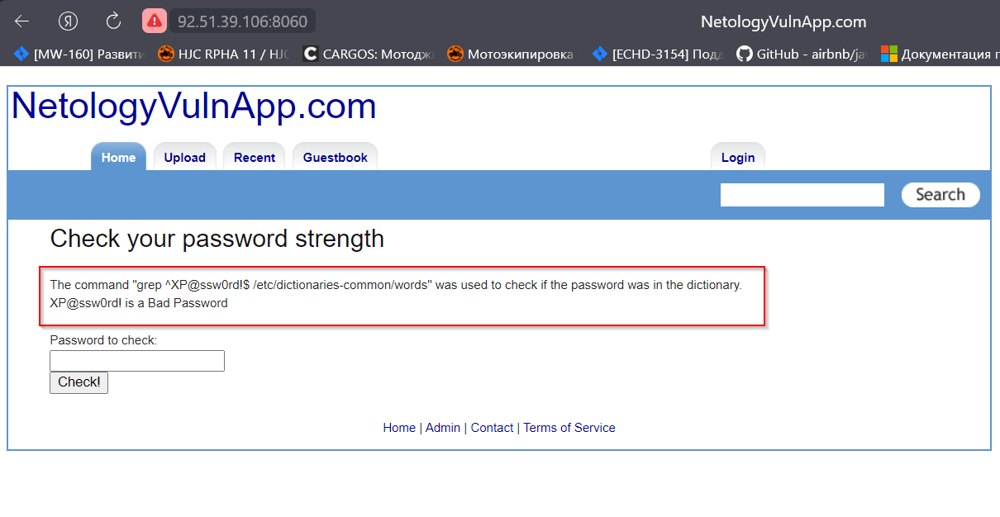  
- Попробуем повлиять на команду и введем один из спец. символов `&, &&, |, ||` для образования `pipeline` (конвейера) команд.  
```sh
test | whoami
```
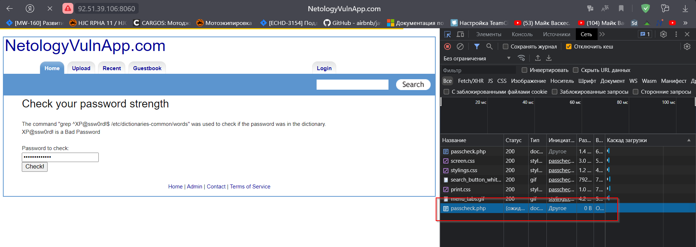  

- После отправки запроса на сервер сайт будет недоступен какое-то время, что является отказом в обслуживании. (Denial of Service)

</details>

---

#### 2. **Уязвимость [Path Traversal](https://owasp.org/www-community/attacks/Path_Traversal) ([A01:2021-Broken Access Control](https://owasp.org/Top10/A01_2021-Broken_Access_Control/))**   
**Критичность:** <font color="red">**Высокая**</font>  
**Страница**: `http://92.51.39.106:8060/admin/index.php?page=login`  
**Описание**: Существует возможность обращения к файловой системе через параметр GET запроса, а так же запуска php-shell скрипта на сервере.
**Предложения по исправлению**:  
 - Валидация значений параметров запросов

<details>
<summary>Подробности реализации</summary>

1. Перейти на страницу `http://92.51.39.106:8060/admin/index.php?page=login`  
2. В параметре `page` использовать следующий вектор атаки:  
```
page=php://filter/read=convert.base64-encode/resource=../users/check_pass
```
В ответ получаем код запрошенной страницы в base64  
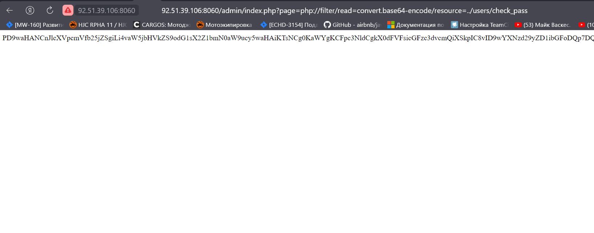
3. Декодируем строку и получаем код страницы  
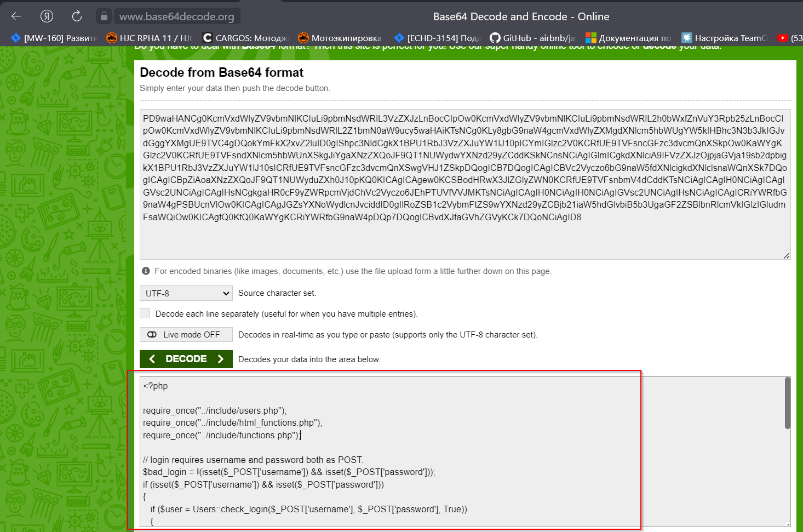

</details>

---

#### 3. **Уязвимость [Unrestricted File Upload](https://owasp.org/www-community/vulnerabilities/Unrestricted_File_Upload). ([A03:2021-Injection](https://owasp.org/Top10/A03_2021-Injection/))**    
**Критичность:** <font color="red">**Высокая**</font>  
**Страница**: `http://92.51.39.106:8060/pictures/upload.php`    
**Описание**:   
Уязвимость позволяет загрузить произвольный файл, отличный от картинки 
Существует возможность выполнения следующих действий:  
- Загрузить PHP-Shell файл

**Предложения по исправлению**:  
 - Добавить валидацию входного по типу содержимого. Например можно использовать сигнатурный анализ файла и сравнивать первые байты файлов с известными сигнатурами. Например, сигнатура для файлов формата JPEG будет выглядеть следующим образом: `FF D8 FF E0`.
 - Запускать приложение под пользователем с минимальными правами. Пользователь не должен иметь прав на чтение системных файлов, тем более на их модификацию или удаление.

<details>
<summary>Подробности реализации</summary>

- Переходим на страницу загрузки файла и заполняем поля формы. Заполняем поле `File Name` произвольным именем файла с окончанием (расширением) `.php`. Далее выбираем специальный [php-shell](assets/shell/php-shell.php)` файл.
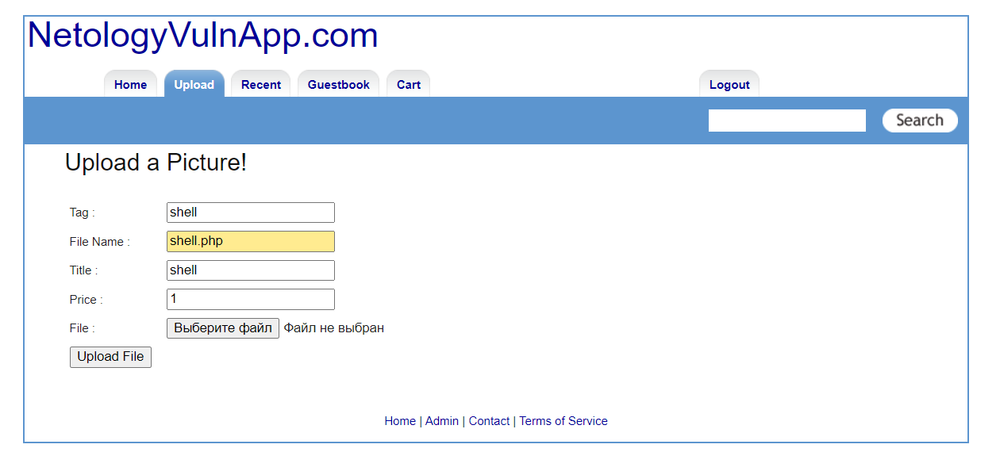  

- После загрузки файла открывается страница просмотра загруженного файла. И в нашем случае картинка не отображается, т.к. был загружен файл с другим содержимым.
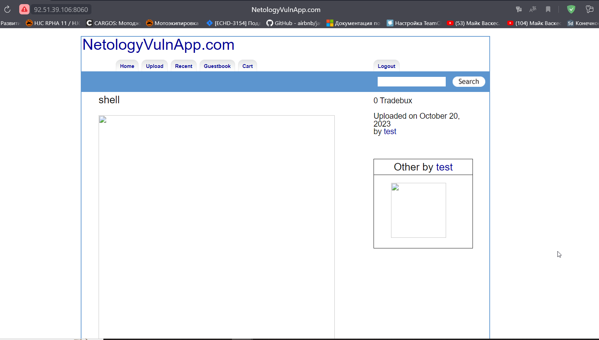  

- Используем уязвимость сервера, которая позволяет просматривать содержимое папки `upload` и определяем путь к нашему файлу. (http://92.51.39.106:8060/upload)  
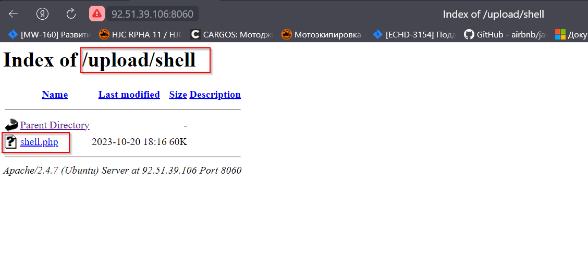

- Используем уязвимость `Path Traversal`. Переходим на страницу `http://92.51.39.106:8060/admin/index.php?page=../upload/shell/shell` и видим окно нашего shell-приложения.
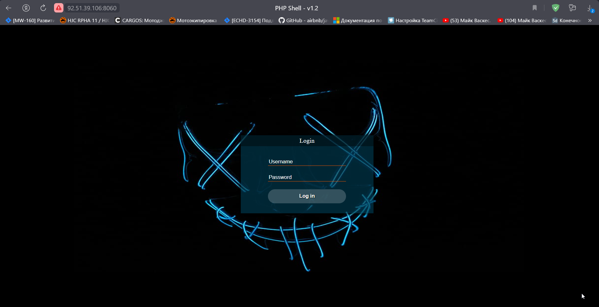

- Заходим в приложение и выполняем команду на сервере для отображения содержимого файла `/etc/passwd`. Сервер отправляет в ответ содержимое запрошенного файла.
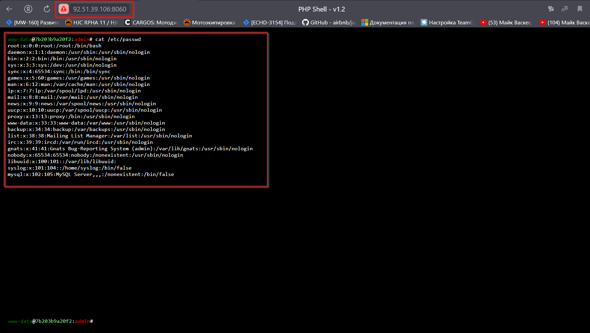

</details>

---

#### 4. **Уязвимость [SQL Injection](https://owasp.org/www-community/attacks/SQL_Injection) ([A03:2021-Injection](https://owasp.org/Top10/A03_2021-Injection/))**  
**Критичность:** <font color="red">**Высокая**</font>  
**Страница**: `http://92.51.39.106:8060/users/login.php`  
**Описание**:  
- Через форму авторизации пользователей есть возможность внедрить sql скрипт в поле логина.

Существует возможность выполнения следующих действий:  
- Добавление, изменение данных в таблицах 
- Удаление данных из таблиц
- Нарушение схемы БД 

**Предложения по исправлению**:  
- Добавить валидацию, санитизацию входных данных с формы 

<details>
<summary>Подробности реализации</summary>

1. Перейти на страницу `http://92.51.39.106:8060/users/login.php` и в форме авторизации в поле логина использовать следующий вектор атаки:  
```
' OR 1 -- -
```
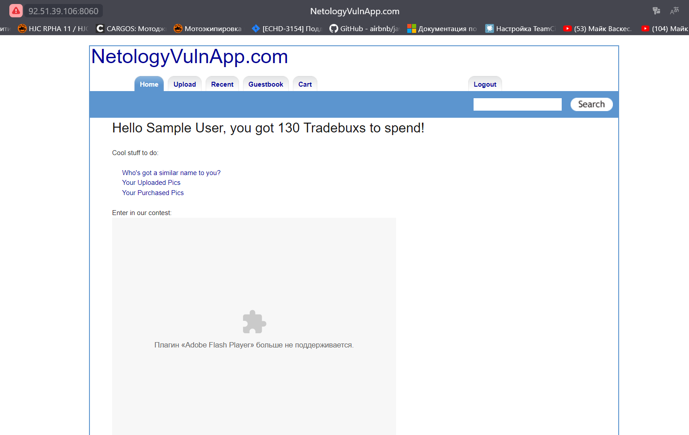

2. Запрос выполнился корректно.  
Мы успешно авторизовываемся по пользователем `Sample User`   

Проблема находится в данном участке кода
```php
 function check_login($username, $pass, $vuln = False)
   {
      if ($vuln)
      {
	 $query = sprintf("SELECT * from `users` where `login` like '%s' and `password` = SHA1( CONCAT('%s', `salt`)) limit 1;",
	                   $username,
	                   mysql_real_escape_string($pass));	 
      }
      else
      {
	 $query = sprintf("SELECT * from `users` where `login` like '%s' and `password` = SHA1( CONCAT('%s', `salt`)) limit 1;",
	                   mysql_real_escape_string($username),
	                   mysql_real_escape_string($pass));
      }
      $res = mysql_query($query);
```
Метод `mysql_real_escape_string` не вызывается для параметра `$username`.

</details>

---

#### 5. **Слабый пароль администратора ([A07:2021-Identification and Authentication Failures](https://owasp.org/Top10/A07_2021-Identification_and_Authentication_Failures/))**  
**Критичность:** <font color="red">**Высокая**</font>  
**Страница**: `http://92.51.39.106:8060/admin/index.php?page=login`  
**Описание**:  
- На странице авторизации администратора сайта используется слабый пароль `admin/admin`

Существует возможность получить несанкционированный доступ к административной консоли. Уязвимость со средней критичностью, т.к. текущая функциональность административной консоли небольшая, но в будущем может быть расширена. 

**Предложения по исправлению**:  
- Использовать сложный пароль
- Ввести ограничение на количество попыток авторизации

<details>
<summary> Подробности реализации</summary>

1. Перейти на страницу `http://92.51.39.106:8060/admin/index.php?page=login` и форме авторизации пользователя ввести логин/пароль: 
`admin/admin`

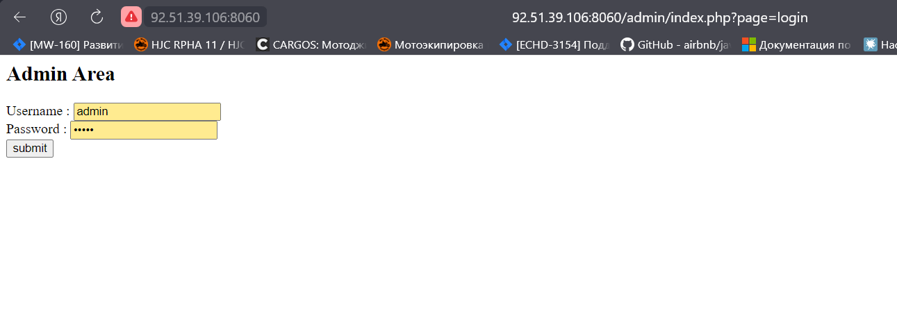
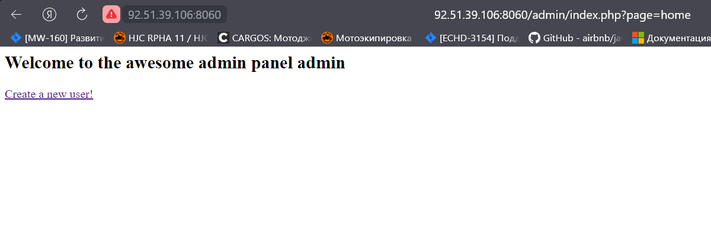
</details>

---

#### 6. **Использование чужой сессии. ([A07:2021-Identification and Authentication Failures](https://owasp.org/Top10/A07_2021-Identification_and_Authentication_Failures/))**  
**Критичность:** <font color="orange">**Средняя**</font>  
**Описание**:   
Есть возможность скопировать сессионную куку пользователя из одного браузера в другой и продолжить работать в обоих браузерах.   
Существует возможность выполнения следующих действий:  
- Кражи пользовательской куки
- Реализация XSS атаки  

**Предложения по исправлению**:  
 - Сделать привязку сессионной куки пользователя к устройству(браузеру)
 - Установить время жизни сессии пользователя в период бездействия

<details>
<summary>Подробности реализации</summary>

- Заходим пользователем `test` на страницу `http://92.51.39.106:8060/guestbook.php` с существующей хранимой XSS. Получаем сообщение с текущими значениями куки пользователя  
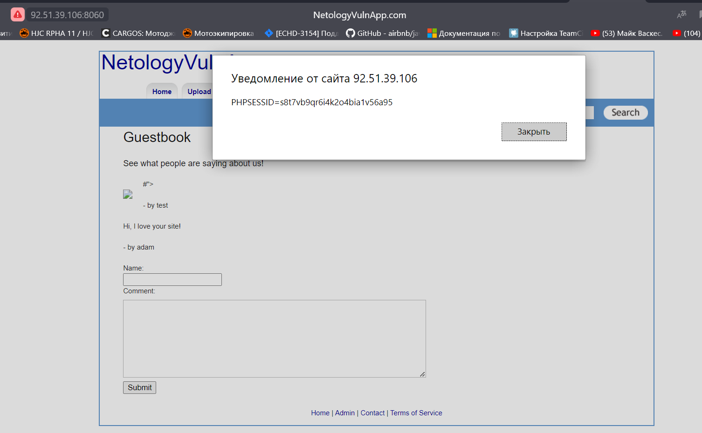  

- Копируем сессионную куку `PHPSESSID` в другой браузер и обновляем страницу. После обновления приложение не будет требовать авторизации и будет отображено имя пользователя `Test`
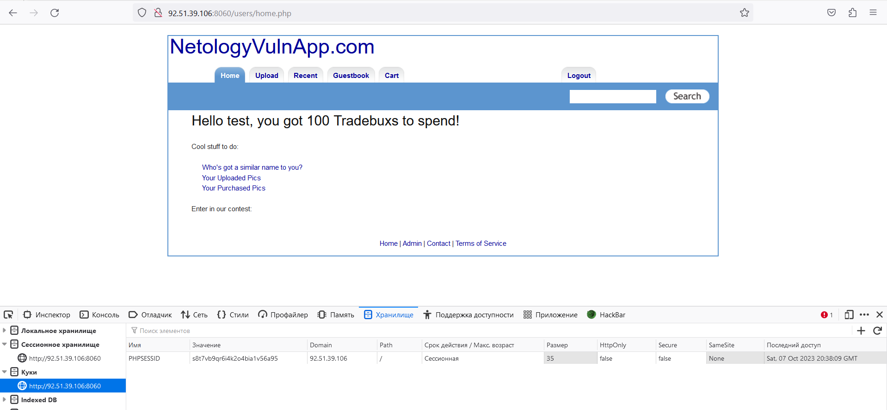  

</details>
---

#### 7. **Уязвимость к XSS атакам ([A03:2021-Injection](https://owasp.org/Top10/A03_2021-Injection/), [Stored XSS](https://owasp.org/www-community/attacks/xss/#stored-xss-attacks))**  
**Критичность:** <font color="orange">**Средняя**</font>  
**Страницы**:  
- `http://92.51.39.106:8060/piccheck.php`  
- `http://92.51.39.106:8060/pictures/search.php?query=`
- `http://92.51.39.106:8060/guestbook.php`  

**Payload**: `#">`
**Описание**: На нескольких страницах происходит добавление пользовательского ввода на страницу без санитизации и экранирования     
Существует возможность выполнения следующих действий:  
- Кража сессионной куки
- Перенаправление пользователей на сторонние сайты
- Выполнение XSRF атак на другие сайты в этой страницы  

**Предложения по исправлению**:  
- Добавить валидацию/санитизацию пользовательского ввода    

<details>
<summary>Подробности реализации</summary>

1. Заходим на стартовую страницу `http://92.51.39.106:8060/`, заполнить уязвимое поле `With this name` и нажать `Send file`  

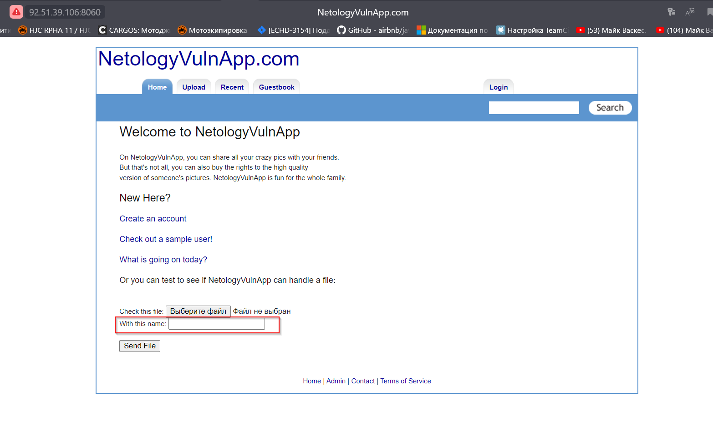  
Далее мы будем перенаправлены на уязвимую страницу `http://92.51.39.106:8060/piccheck.php`  

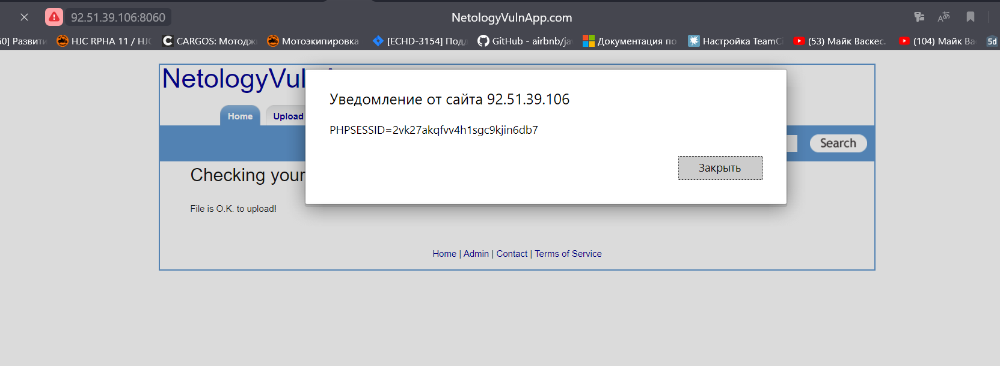  

2. Заходим на любую страницу содержащую поисковое поле, например `http://92.51.39.106:8060/pictures/search.php?query=`.  
Используем полигон для тестирования XSS.  

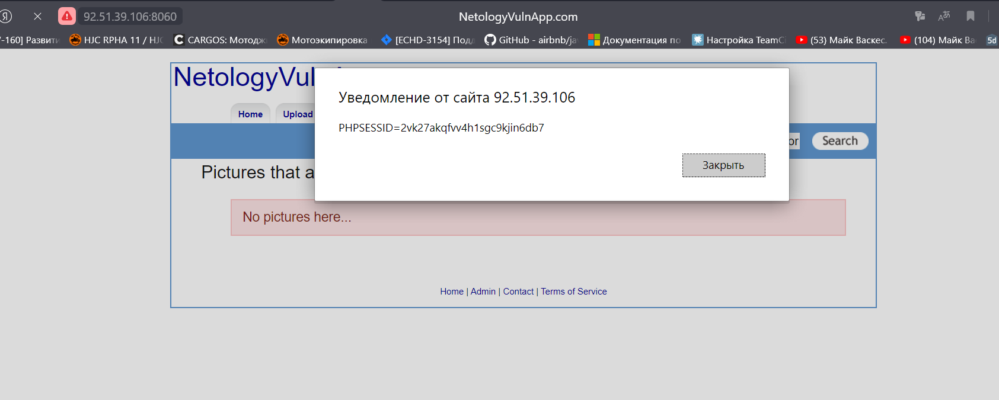  

3. Заходим на любую страницу `http://92.51.39.106:8060/guestbook.php` и заполням поля `Name` и `Comment`.  

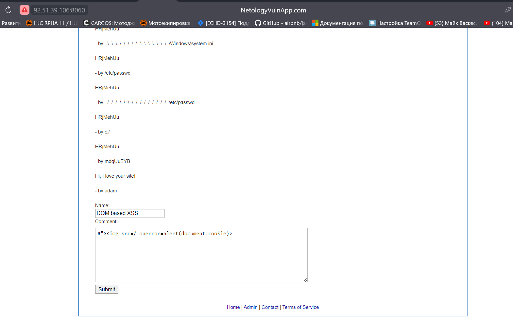  

Используем полигон для тестирования XSS.  

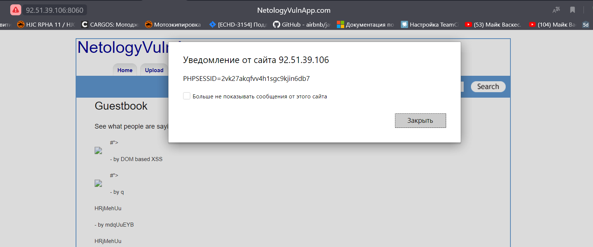  

</details>

----

#### 8. **Уязвимость к BruteForce атакам. ([A07:2021-Identification and Authentication Failures](https://owasp.org/Top10/A07_2021-Identification_and_Authentication_Failures/))**    
**Критичность:** <font color="orange">**Средняя**</font>  
**Страница**: `http://92.51.39.106:8060/users/login.php`  
**Описание**: При авторизации в приложении нет ограничений на количество попыток ввода паролей пользователей, что открывает возможность к перебору пароля от известного пользователя или подбору комбинации логина и пароля.    
Существует возможность выполнения следующих действий:  
- Подбор пароля методом "грубой силы"  

**Предложения по исправлению**:  
 - Установить ограничение попыток ввода пароля
 - Установить ограничение попыток авторизации по IP-адресу

<details>
<summary>Подробности реализации</summary>

Для упрощения задачи используем заданее известный логин пользователя `test`. 

```
hydra -l test -P "/usr/share/wordlists/rockyou.txt" -s 8060 92.51.39.106 http-post-form "/users/login.php:username=t
est&password=^PASS^:F=The username/password combination you have entered is invalid" -f -v
```

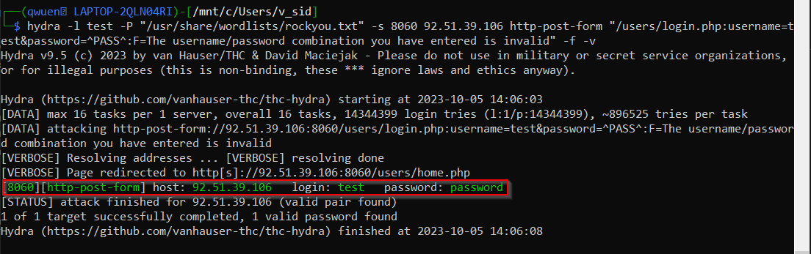

</details>

----

#### 9. **Отсутствие защиты от атак типа Сlickjacking, XSRF. ([A01:2021-Broken Access Control](https://owasp.org/Top10/A01_2021-Broken_Access_Control/))**    
**Критичность:** <font color="orange">**Средняя**</font>  
**Страница**: `http://92.51.39.106:8060/cart/action.php?action=add&picid=11`    
**Описание**:   
Уязвимость позволяет заставить пользователя, который находится на одном сайте выполнять действия на другом сайте. Это работает за счет отправки от имени пользователя запросов на другой сайт, где у пользователя есть активная сессия. Целевой сайт будет получать сессионные куки пользователя, проводить идентификацию и выполнять запрос от имени пользователя. В случае атаки `Сlickjacking` сущетвует возможность открыть целевой сайт в `iframe` и отобразить поверх своего сайта с прозрачным фоном. Пользователь будет работать с одним сайтом и тем временем наживать реальные кнопки в `iframe` и выполнять действия на другом сайте.  
Существует возможность выполнения следующих действий:  
- Загрузка сайта в iframe 
- Отправка запросов на другой сайт вместе с сессионными куками  

**Предложения по исправлению**:  
 - Установить флаг сессионной куки `SameSite:"Strict"`
 - Установить заголовок `X-Frame-Options: SAMEORIGIN` или `DENY`  
 `DENY`- Никогда не показывать страницу внутри фрейма.  
 `SAMEORIGIN` - Разрешить открытие страницы внутри фрейма только в том случае, если родительский документ имеет тот же источник.
- Добавить csrf токены на страницы и производить проверку токена при осуществлении действий на странице.  

<details>
<summary>Подробности реализации</summary>

- Создаем страницу с подготовленной формой и `iframe` с целевым сайтом  

```
<a href="http://92.51.39.106:8060/cart/action.php?action=add&picid=11">Add to card</a>
<br>
   
<iframe width="1000px" height="1000px" src="http://92.51.39.106:8060"></iframe>
```
- Пользователь нажимает кнопку `Add to card` и тем временем выполняет запрос на добавление элемента в карзину на другом сайте.

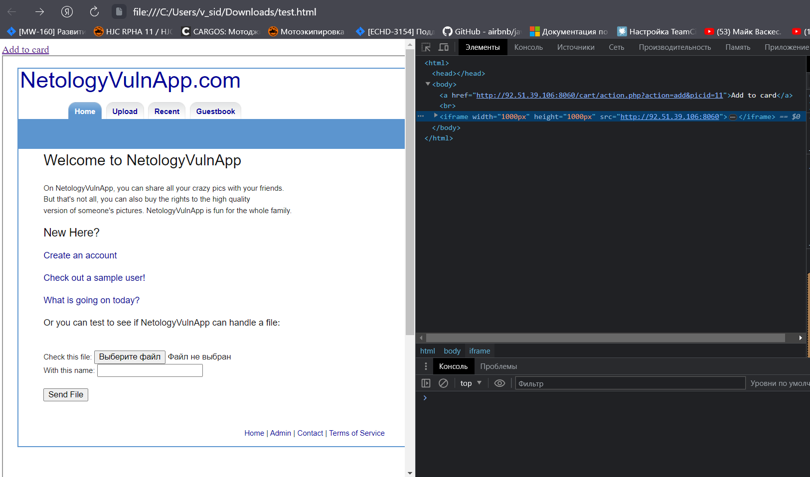  

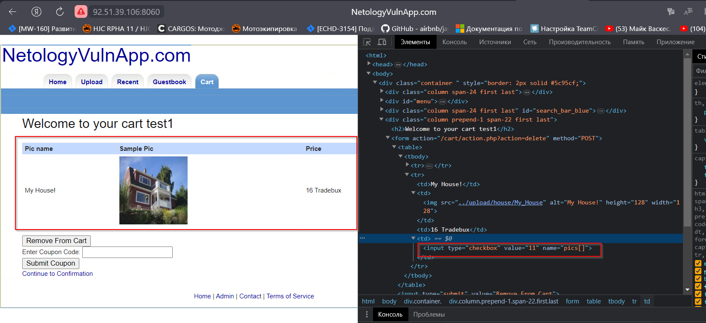

</details>

----


