### Результаты тестирования
#### 1. **Уязвимости Command Injection ([A05:2021-Security Misconfiguration](https://owasp.org/Top10/A05_2021-Security_Misconfiguration/), [A03:2021-Injection](https://owasp.org/Top10/A03_2021-Injection/))**
**Критичность:** <font color="red">**Высокая**</font>  
**Страница**: `http://92.51.39.106:7799/server.html`  
**Описание**: На странице есть функционал проверки доступности сервера. Сервис проверяет отправляет `ping` запрос из консоли для введенного ip-адреса. При этом пользовательский ввод никак не проверяется. Есть возможность отправить shell-код, который будет выполнен на сервере и результат выполнения будет возвращен в UI.

**Предложения по исправлению**:  
 - Использовать санитизацию и экранирование пользовательского ввода

<details>
<summary>Подробности реализации</summary>

- Заходим на исследуемую страницу и вводим в поле ввода следующую команду `127.0.0.1 & cat /etc/passwd`, которая объединяет результаты команды `ping` и `cat`. После выполнения команды на сервере будет отображено содержимое файла `/etc/passwd`
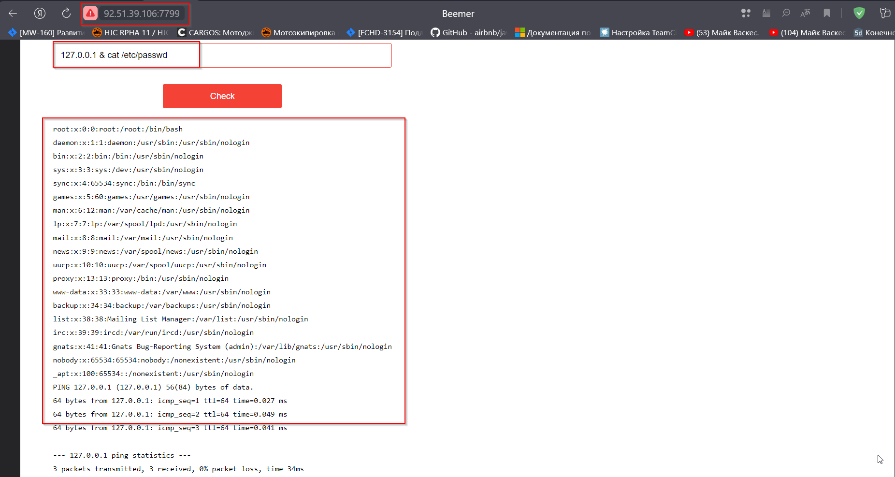  

- Далее выполняем команду `127.0.0.1 & whoami` для получения текущего пользователя, из под которого работает приложение.
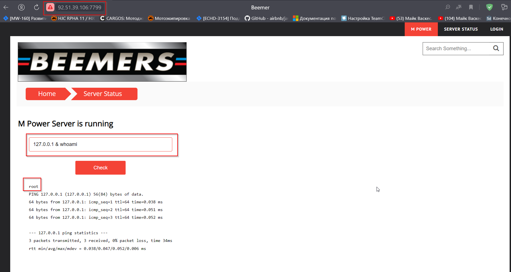

- В ответе сервера получаем, что приложение работает под пользователем `root`, а значит наши права на сервер не ограничены.

</details>

---

#### 2. **Уязвимость [Path Traversal](https://owasp.org/www-community/attacks/Path_Traversal) ([A01:2021-Broken Access Control](https://owasp.org/Top10/A01_2021-Broken_Access_Control/))**   
**Критичность:** <font color="red">**Высокая**</font>  
**Страница**:  
- `http://92.51.39.106:7799/read?file=`  
- `http://92.51.39.106:7799/static/`

**Описание**: Существует возможность обращения к файловой системе через параметр GET запроса  
**Предложения по исправлению**:  
 - Валидация значений параметров запросов

<details>
<summary>Подробности реализации</summary>

1. Перейти на страницу `http://92.51.39.106:7799/read?file=../../../../../../etc/passwd`, в ответ сервер отобразит содержимое файла `/etc/passwd`
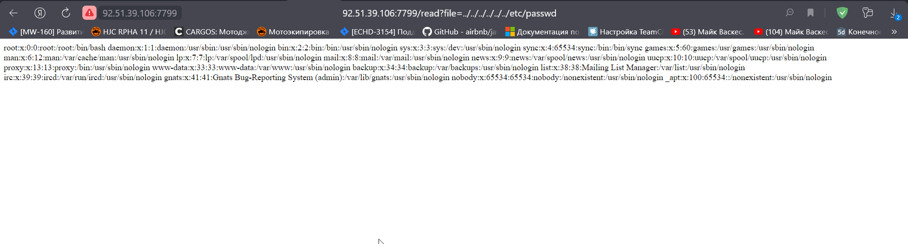
2. Перейти на страницу `http://92.51.39.106:7799/static/..%2F..%2F..%2F..%2F..%2F..%2F..%2F..%2F..%2F..%2F..%2F..%2F..%2F..%2F..%2F..%2Fetc%2Fpasswd`, в ответ сервер отобразит содержимое файла `/etc/passwd`
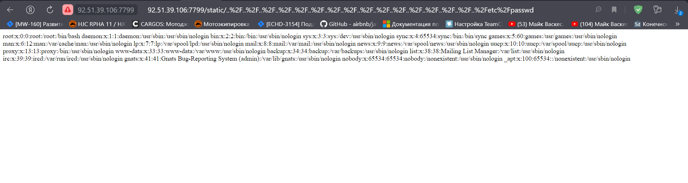

</details>

---

#### 3. **Уязвимость [Unrestricted File Upload](https://owasp.org/www-community/vulnerabilities/Unrestricted_File_Upload). ([A03:2021-Injection](https://owasp.org/Top10/A03_2021-Injection/))**    
**Критичность:** <font color="red">**Высокая**</font>  
**Страница**: `http://92.51.39.106:7799/index.html`    
**Описание**:   
Уязвимость позволяет загрузить произвольный файл, отличный от картинки 
Существует возможность выполнения следующих действий:  
- Загрузить PHP-Shell файл

**Предложения по исправлению**:  
 - Добавить валидацию входного по типу содержимого. Например можно использовать сигнатурный анализ файла и сравнивать первые байты файлов с известными сигнатурами. Например, сигнатура для файлов формата JPEG будет выглядеть следующим образом: `FF D8 FF E0`.
 - Запускать приложение под пользователем с минимальными правами. Пользователь не должен иметь прав на чтение системных файлов, тем более на их модификацию или удаление.

<details>
<summary>Подробности реализации</summary>

- Переходим на страницу загрузки файла и выбираем специальный [php-shell](assets/shell/php-shell.php)` файл.
  

- После загрузки файла открывается страница с сообщением `fileqrizoz.php is uploaded`
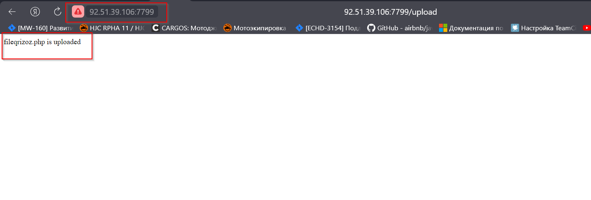  

- Используем уязвимость сервера, которая позволяет просматривать список файлов сервера и читаем код текущего приложения. На странице `http://92.51.39.106:7799/server.html` используем следующую команду - `127.0.0.1 | cat server.py`. По коду сервера понимаем, что пользовательские файлы попадают в папку `/tmp/`.
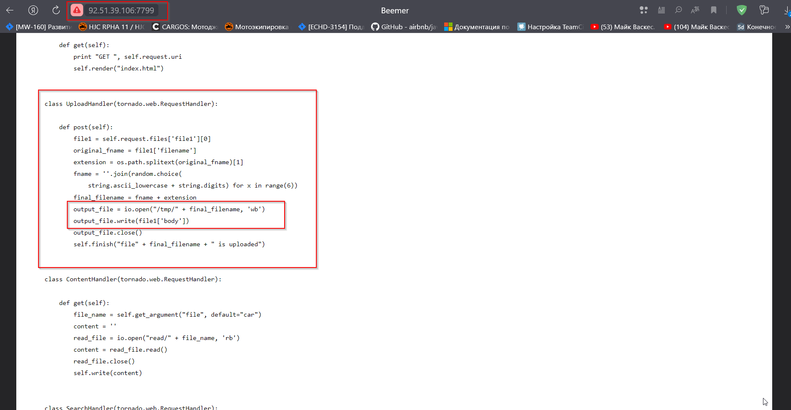

- Проверяем наличие нашего файла в директории `/tmp/`. Для этого на той же странице `http://92.51.39.106:7799/server.html` вводим команду `127.0.0.1 | ls /tmp`. Находим имя нашего файла, оно будет без приставки `file`.
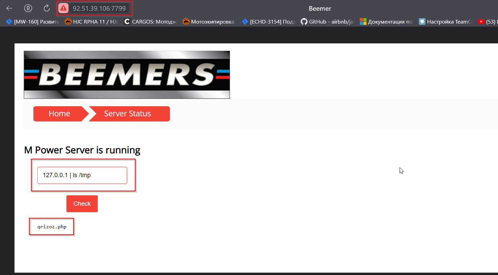

- Используем уязвимость `Path Traversal`. Переходим на страницу `http://92.51.39.106:7799/read?file=../../../../../../tmp/qrizoz.php` и видим окно нашего shell-приложения.
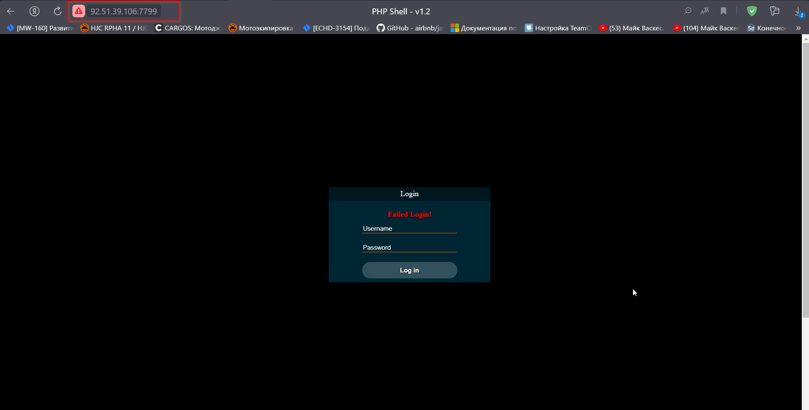

</details>

---

#### 4. **Уязвимость [SQL Injection](https://owasp.org/www-community/attacks/SQL_Injection) ([A03:2021-Injection](https://owasp.org/Top10/A03_2021-Injection/))**  
**Критичность:** <font color="red">**Высокая**</font>  
**Страница**: `http://92.51.39.106:7799/login.html`  
**Описание**:  
- Через форму авторизации пользователей есть возможность внедрить sql скрипт в поле логина.

Существует возможность выполнения следующих действий:  
- Добавление, изменение данных в таблицах 
- Удаление данных из таблиц
- Нарушение схемы БД 

**Предложения по исправлению**:  
- Добавить валидацию, санитизацию входных данных с формы 

<details>
<summary>Подробности реализации</summary>

1. Перейти на страницу `http://92.51.39.106:7799/login.html` и в форме авторизации в поле логина использовать следующий вектор атаки `admin' --`, а поле пароля любое значение. 

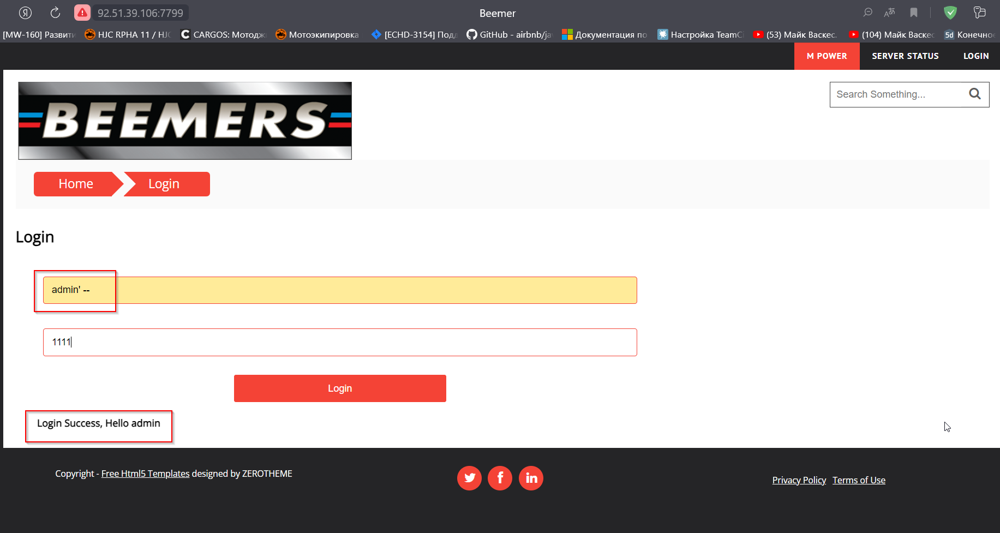

2. Запрос выполнился корректно.  
Мы видим сообщение `Login Success, Hello admin`   

</details>

---

#### 5. **Уязвимость к XSS атакам ([A03:2021-Injection](https://owasp.org/Top10/A03_2021-Injection/), [Stored XSS](https://owasp.org/www-community/attacks/xss/#stored-xss-attacks))**  
**Критичность:** <font color="orange">**Средняя**</font>  
**Страницы**: `http://92.51.39.106:7799/search?q=`  
**Payload**: `#">`
**Описание**: На нескольких страницах происходит добавление пользовательского ввода на страницу без санитизации и экранирования     
Существует возможность выполнения следующих действий:  
- Кража сессионной куки
- Перенаправление пользователей на сторонние сайты
- Выполнение XSRF атак на другие сайты в этой страницы  

**Предложения по исправлению**:  
- Добавить валидацию/санитизацию пользовательского ввода    

<details>
<summary>Подробности реализации</summary>

1. Заходим на стартовую страницу `http://92.51.39.106:7799/index.html`, заполняем поисковое поле и нажать кнопку `Enter`  
Используем при этом полигон для тестирования XSS.  

2. Далее мы будем перенаправлены на уязвимую страницу `http://92.51.39.106:7799/search?q=`, где в диалоговом окне увидим идентификатор нашей сессии.

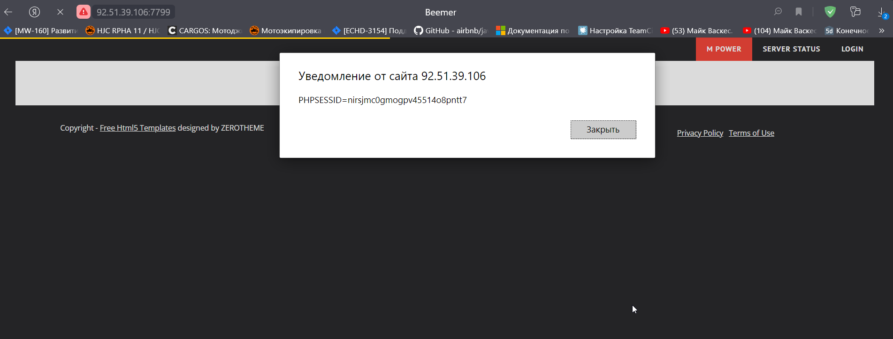  

</details>

----

#### 6. **Уязвимость к BruteForce атакам. ([A07:2021-Identification and Authentication Failures](https://owasp.org/Top10/A07_2021-Identification_and_Authentication_Failures/))**    
**Критичность:** <font color="orange">**Средняя**</font>  
**Страница**: `http://92.51.39.106:7799/login.html`  
**Описание**: При авторизации в приложении нет ограничений на количество попыток ввода паролей пользователей, что открывает возможность к перебору пароля от известного пользователя или подбору комбинации логина и пароля.    
Существует возможность выполнения следующих действий:  
- Подбор пароля методом "грубой силы"  

**Предложения по исправлению**:  
 - Установить ограничение попыток ввода пароля
 - Установить ограничение попыток авторизации по IP-адресу

<details>
<summary>Подробности реализации</summary>

Для упрощения задачи используем заданее известный логин пользователя `test`. 

```
hydra -l admin -P "/mnt/c/pas/test-pw.txt" -s 7799 92.51.39.106 http-post-form "/login.html:username=admin&password=
^PASS^:F=Login Failed" -f -v
```

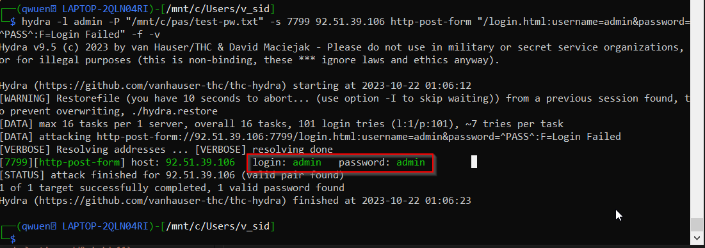

</details>

----

